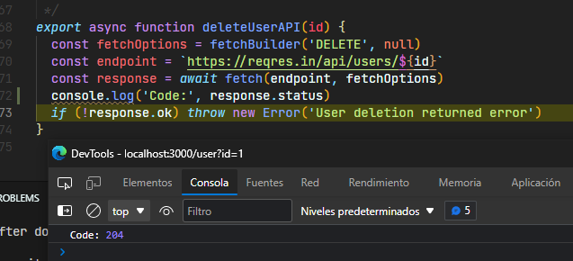

# Info General

Esto es el proyecto `Prueba React` que hice para el equipo de React. Este proyecto se ha desarrollado con JavaScript, framework React, middleware Saga. Para el diseño se han usado las tecnologías SASS, SCSS, Styled-Components.

## Contenido
- [Info General](#info-general)
  * [Instalación](#instalación)
  * [Uso](#uso)
  * [Tecnologías](#tecnologías)
  * [Explicación breve](#explicación-breve)
  * [Info Adicional](#info-adicional)
    + [1. Uso de React](#1-uso-de-react)
    + [2. Uso de Redux](#2-uso-de-redux)
    + [3. Navegacion](#3-navegación)
    + [4. Maquetación](#4-maquetación)
    + [5. Formato de código](#5-formato-de-código)
    + [6. Asincronia (CRUD)](#6-asincronia-(crud))
    + [7. Documentacion](#7-documentación)
  * [Requisitos opcionales](#requisitos-opcionales)
  * [Más Info Adicional](#más-info-adicional)
    + [Componentes](#componentes)
  * [Elemplos](#ejemplos)

## Instalación

Para instalar este proyecto es necesario descargar el entorno de tiempo de ejecución de JavaScript [Node.js](https://nodejs.org/es/download/).

1. Lo primero que se necesita hacer es descargar este repositorio en la máquina local.

```
git clone https://github.com/CloudNine13/prueba-react.git
```

2. Entrar en la carpeta donde se encuentra el proyecto recién descargado.

```bash
cd *path/to/repositorio/local*
```

3. Comprobar el archivo `package.json` para asegurarse de que los scripts están bien puestos.

```json
"scripts": {
    "start": "react-scripts start",
    "build": "react-scripts build",
    "test": "react-scripts test",
    "eject": "react-scripts eject"
  },
```

4. Borrar todas las carpetas de `node_module` y los acrhivos `.lock` tipo `package-lock.json`
5. Instalar las dependencias de npm

```
npm install
```

6. Ejecutar npm

```
npm start
```

## Uso

Para lanzar el servidor y poner la aplicación de React en marcha se usa el script

```
npm start
```

Para ejecutar los test del proyecto se usa el script

```
npm test
```

## Tecnologías

Tecnologías usadas en este proyecto son:

- react: 18.2.0
- redux: 4.2.0
- @reduxjs/toolkit: 1.8.3
- redux-saga: 1.1.
- react-router-dom: 6.3.0
- prop-types: 15.8.1
- history: 5.3.0
- sass: 1.53.0
- styled-components: 5.3.5
- @testing-library/react: 13.3.0
- @testing-library/jest-dom: 5.16.4
- eslint: 8.19.0
- prettier: 2.7.1
- redux-mock-store: 1.5.4

## Explicación breve

El proyecto se empieza con el componente `Login` (salvo el componente `Router`). Dentro del Login se encuentra la forma para authentificarse. La API permite cualquier contraseña. Para evitar posibles problemas de null/undefined no es posible pasar la contraseña vacía. Al hacerlo aparece error. Si proponer a la API el correo que no es de un usuario de la API aparece el error. En la página de login se puede pasar a la página de error 404 y probar cambiar el background de la página (gracias a los `Styled-Components`). Después de loguearse con el correo correcto (por ejemplo eve.holt@reqres.in) la app abre la pantalla de `Home`. En esta página se encuentra la listá de usuarios, la paginación simple y el botón para hacer logout. Al pulsar cualquier usuario se abre la pantalla de detalles de usuario, donde se encuentra la tarjeta con su información (el componente `Detail`). Al pulsar el botón `Back` la app se vuelve a la lista. Al pulsar el botón `Delete` la API devuelve el código 204,la app se vuelve a la página anterior y se borra el item del usuario (hasta pasar a otra página). Al pulsar el botón `Edit` se abre el componente `DetailForm` que contiene la forma para mandar cambios a la API. Al editar los datos y pulsar `submit` la app se guarda la tarjeta con cambios recién hechos hasta salir del Detail.

## Info Adicional

`N.B.!` No se ha espicificado el lenguaje para usar por esto he elegido al azár JavaScript. Si se necesita reescribir el proyecto en TypeScript no habrá ningún problema para hacerlo.

### 1. Uso de React

- En la aplicación se utilizó la utilidad create-react-app.
- Se implementó la programación funcional (hooks).

### 2. Uso de Redux

- Se utilizó la tecnología Redux con su middleware Saga.

### 3. Navegación

Navegación entre componentes se realiza por react-router v6.

### 4. Maquetación

- Se han implementado preprocesador de estilos `SASS, SCSS`
- Se han utilizado los `Styled-Components`, a través de estos se puede cambiar el fondo del componente Login.
- Se ha utilizado el brakepoint para IPads y tablets (min-width: 480px, max-width: 768px):
  https://www.google.com/url?sa=t&rct=j&q=&esrc=s&source=web&cd=&ved=2ahUKEwihos3YwPD4AhWM_IUKHfojBzMQFnoECBMQAw&url=https%3A%2F%2Fwww.lambdatest.com%2Fblog%2Fhow-to-use-css-breakpoints-for-responsive-design%2F%23%3A~%3Atext%3DWhat%2520are%2520common%2520breakpoints%253F%2Cextra%2520large%2520screens%2520like%2520TV.&usg=AOvVaw1qBDBkjLTQS0nIaszxn0uk

### 5. Formato de código

- Se ha implementado ESLinter (para los tests también).
- Se ha implementado Prettier.
- El pre-commit hook implementado en este proyecto se encuentra en la carpeta .git (para ejecutarlo antes de commit, esta carpeta no se comparte en GitHub) y en la carpeta examples (que se comparte en GitHub).

### 6. Asincronia (CRUD)

- Cada petición a la API es asíncrona. Cada dispatch de la petición a la API es asíncrono (gracias al uso de Saga).
- Las partes de código que pueden causar errores tienen bloques try-catch. Si no lo tienen se usan peticiones FAILURE en funciones generadoras que meten errores en la pantalla.

### 7. Documentación

A parte de este archivo el código está documentado.

## Requisitos opcionales

- Se ha desarrollado la paginación simple de usuarios en el proyecto.
- Se han implementado los tests usando librerías React-Testing-Library y Jest

## Más Info Adicional

### Componentes

Los componentes están en `src/components/`. Cada component de este proyecto tiene su propia carpeta. Por dentro de esta carpeta se encuentran un archivo de diseño `.sass, .scss, .styled.js`, un archivo JavaScript y un archivo de tests. Algunos components son childs de otros componentes:

```
parent -> child
detail -> detailform
home -> item
```

Get y delete tienen el mismo `reducer` por necesitar cambiar el mismo `state` para borrar los elementos de la lista de usuarios.
El componente login aparece en cada archivo donde se usa la asincronía.

## Ejemplos
### Pre-commit-hook

### DELETE API response

### PUT API Update user
Key `updated_at` que devuelve la API significa que la petición ha sido exitosa
